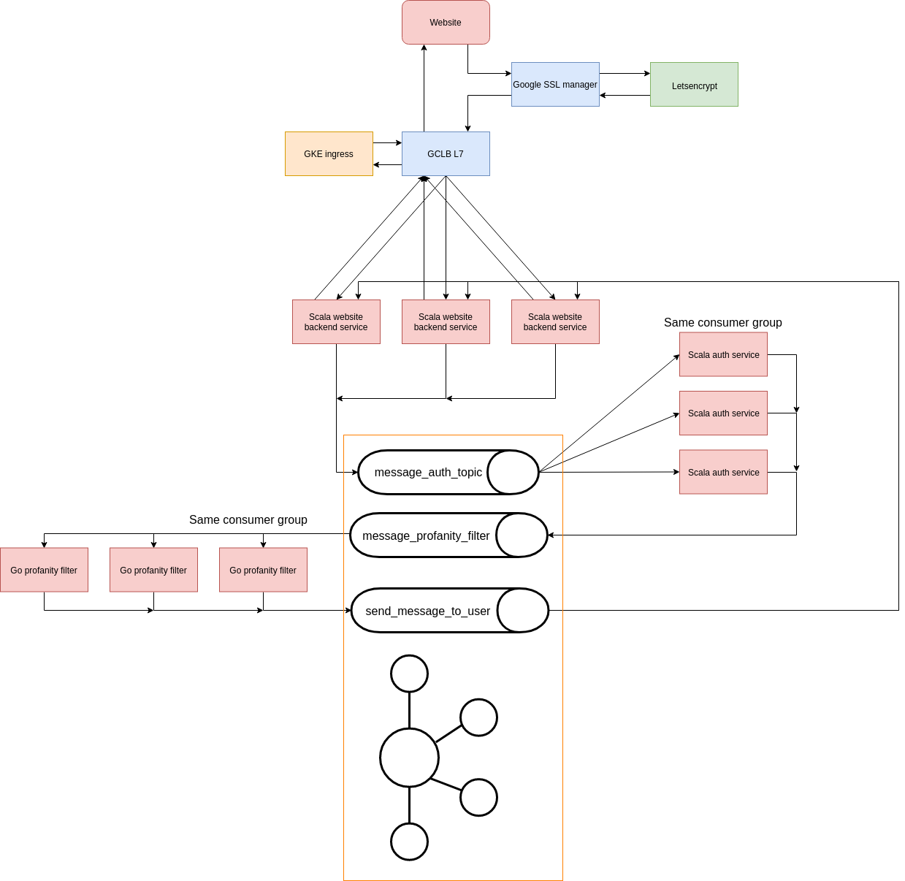

# Chat application
## Formal description
The application will be a simple chat application with a login and chat system.
## Details
The application as of now will consist of three microservices:
* A backend for serving the page (Scala).
* A service for handling user login requests (Scala).
* A service for handling profanities (Go).
## Functional & reactive messaging
Functional messaging, a message will given all the required steps when sent around:

### Message structure
```json
{
  "destinationid": 42,
  "message": "Hello world!",
  "fromautoreply": false
}
```

### Event sourcing structure
```json
{
  "messageid": "UID",
  "senderid": 12,
  "messagedestinations": [
    {
      "destinationid": 42,
      "message": "Hello world!",
      "fromautoreply": false
    }
  ],
  "tasks": {
    "1": "TOPIC1",
    "2": "TOPIC2"
  }
}
```
### An example following the image

