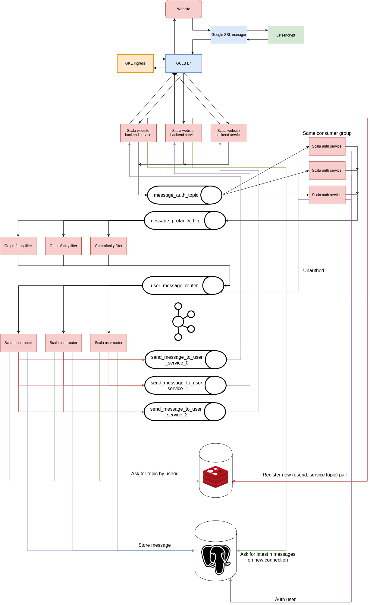

# Chat application
## Formal description
The application will be a simple chat application with a login and chat system.
## Details
The application as of now will consist of three microservices:
* A backend for serving the page (Scala).
* A service for handling user login requests (Scala).
* A service for handling profanities (Go).
## Functional & reactive messaging
Functional messaging, a message will given all the required steps when sent around:
```json
{
  "messageid": "UID",
  "userid": 42,
  "statefuldata": "MESSAGE",
  "tasks": {
    "1": {
      "topic": "TOPIC1",
      "parameters": "GENERIC_JSON"
    },
    "2": {
      "topic": "TOPIC2",
      "parameters": null
    }
  }
}
```
### An example following the image


Here the data could look like the following, given the `Scala auth service` authenticates the user:
```json
{
  "messageid": "ABC2142ABC",
  "userid": 42,
  "statefuldata": "Hello CURSEWORD world!",
  "tasks": {
    "1": {
      "topic": "message_auth_topic",
      "parameters": null
    },
    "2": {
      "topic": "message_profanity_filter",
      "parameters": {
        "additionalProfanities": [
          "profanity1",
          "profanity2"
        ]
      }
    },
    "3": {
      "topic": "user_message_router",
      "parameters": {
        "recievers": [
          66,
          1,
          19
        ]
      }
    }
  }
}
```
Given the `Scala auth service` does not:
```json
{
  "messageid": "ABC2142ABC",
  "userid": 42,
  "statefuldata": "Hello CURSEWORD world!",
  "tasks": {
    "1": {
      "topic": "message_auth_topic",
      "parameters": null
    },
    "2": {
      "topic": "user_message_router",
      "parameters": {
        "error": 401
      }
    }
  }
}
```